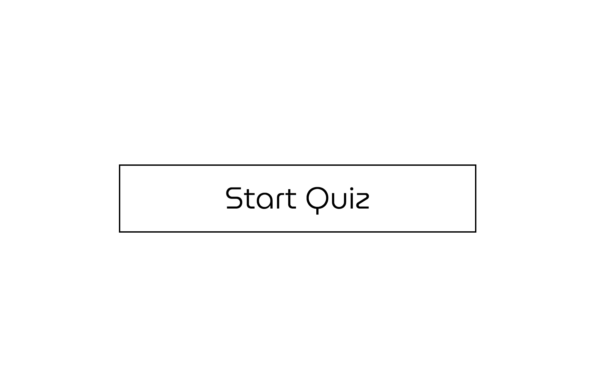
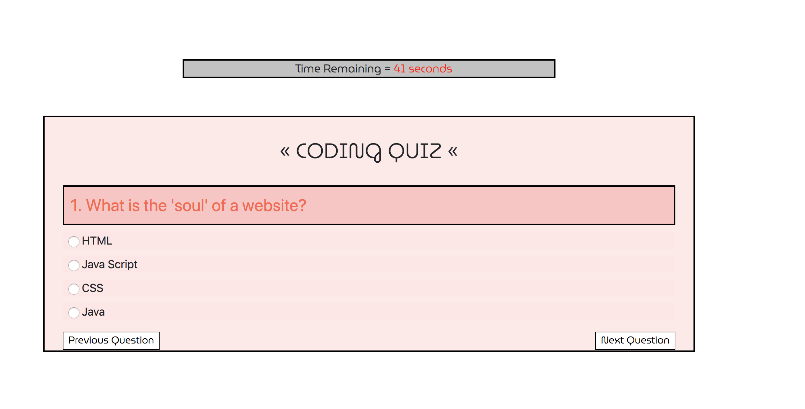
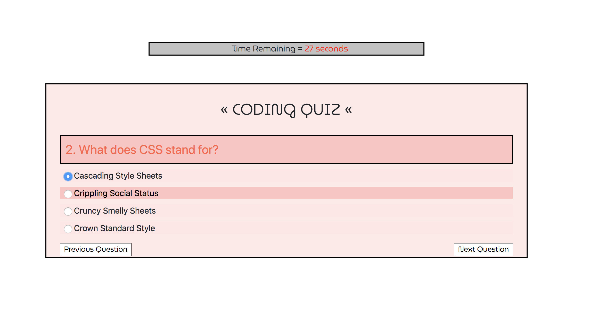
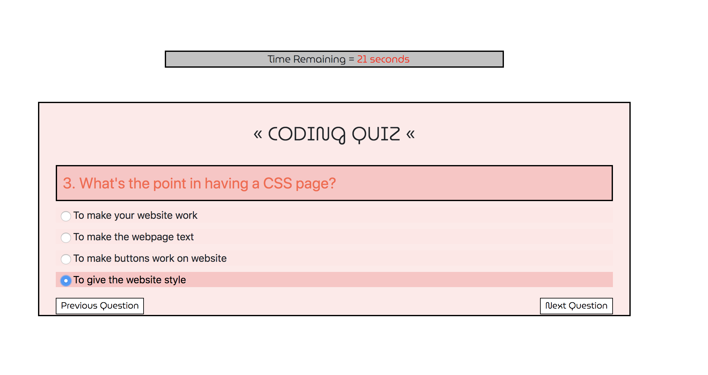
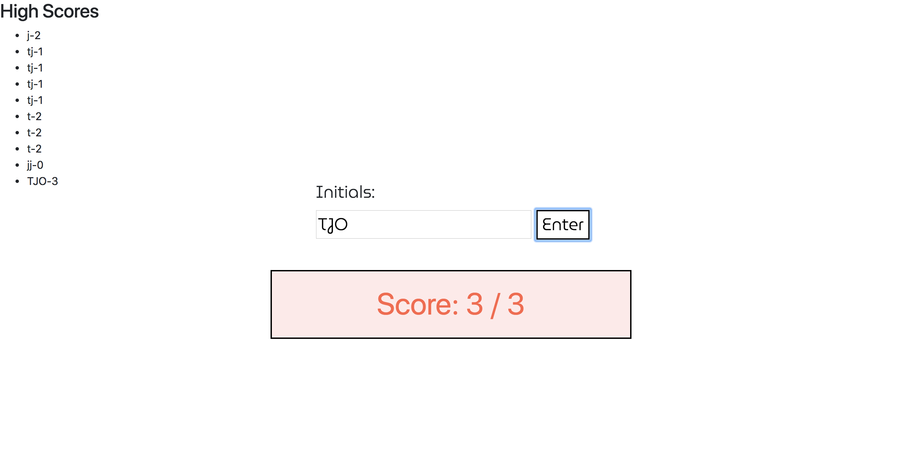

In this project I created a web API. This is a short quiz of simple coding questions. I created a start button, countdown timer, score, questions, previous and next question buttons, and stored all the data in local storage. I was able to store the scores and initials with each quiz score. I made each container disappear with each seperate page and terminate the timer along with the questions to display the users score.

<h3>Parameters</h3>

```
GIVEN I am taking a code quiz
WHEN I click the start button
THEN a timer starts and I am presented with a question
WHEN I answer a question
THEN I am presented with another question
WHEN I answer a question incorrectly
THEN time is subtracted from the clock
WHEN all questions are answered or the timer reaches 0
THEN the game is over
WHEN the game is over
THEN I can save my initials and score
```

<h3>Link To Website</h3>

<a>https://trevorotterson.github.io/quiz_me/</a>

<h3>Screenshots Of Pages</h3>





